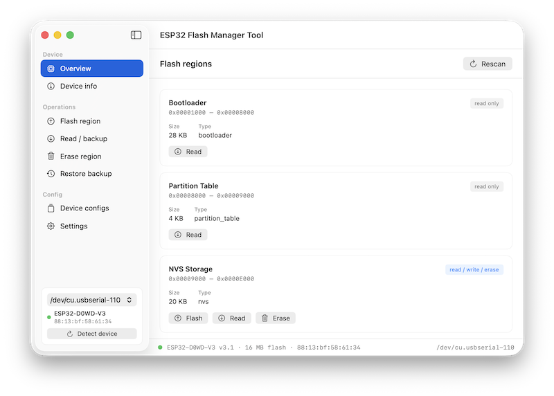
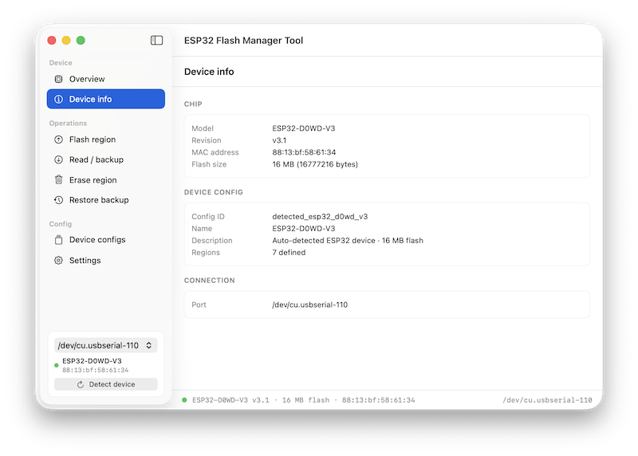
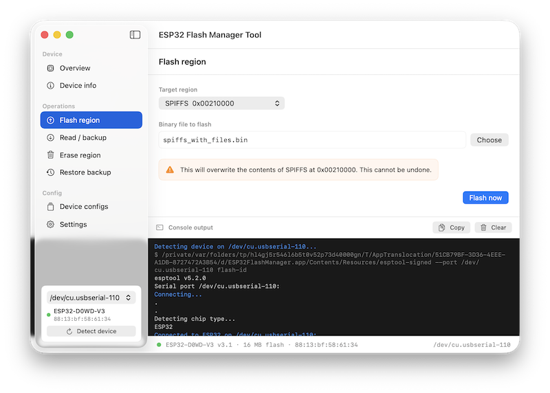
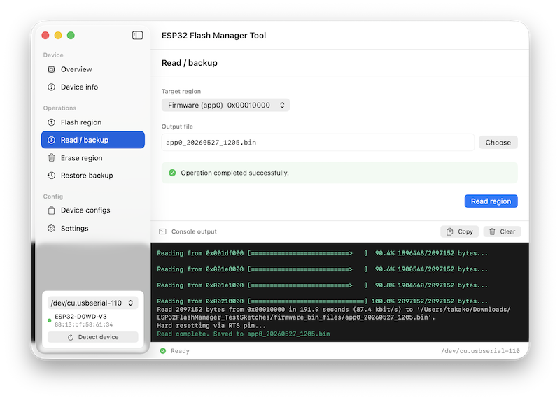
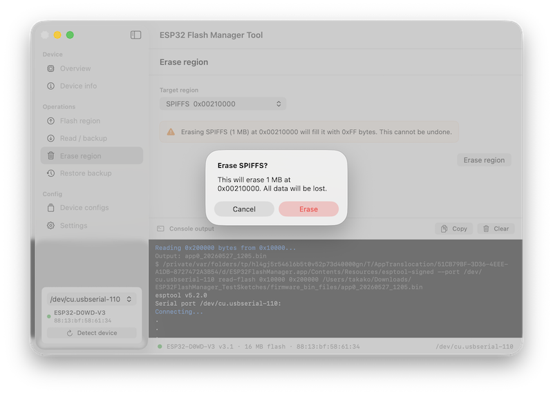
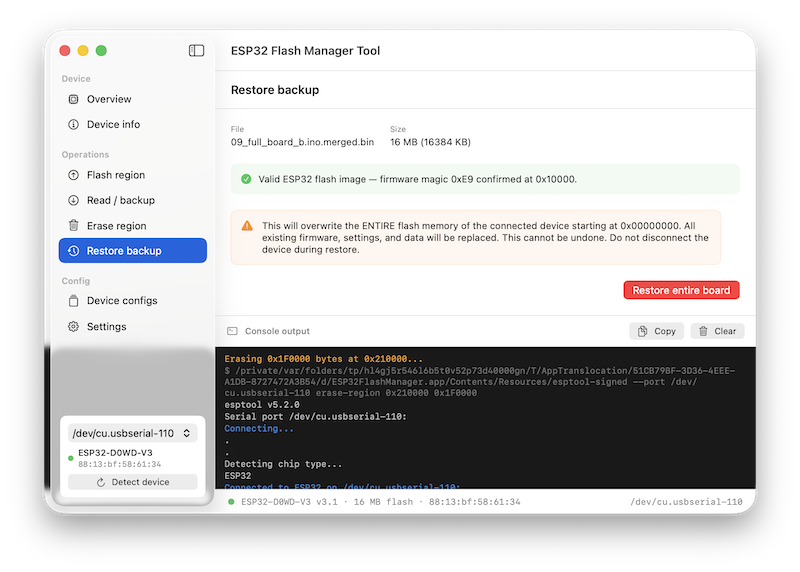
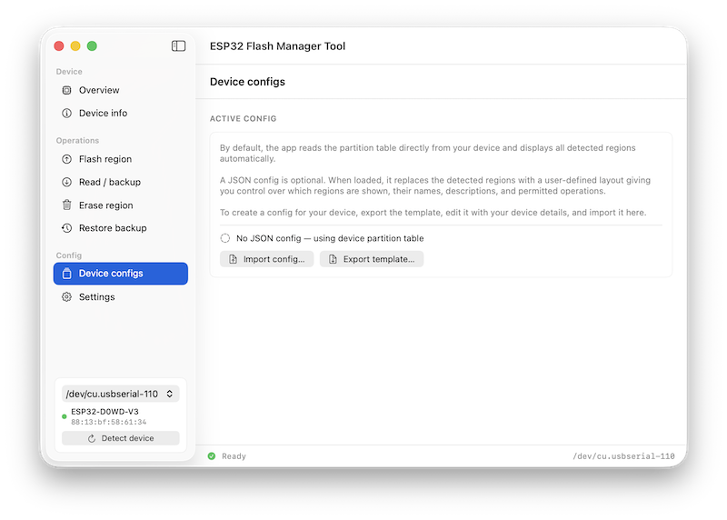
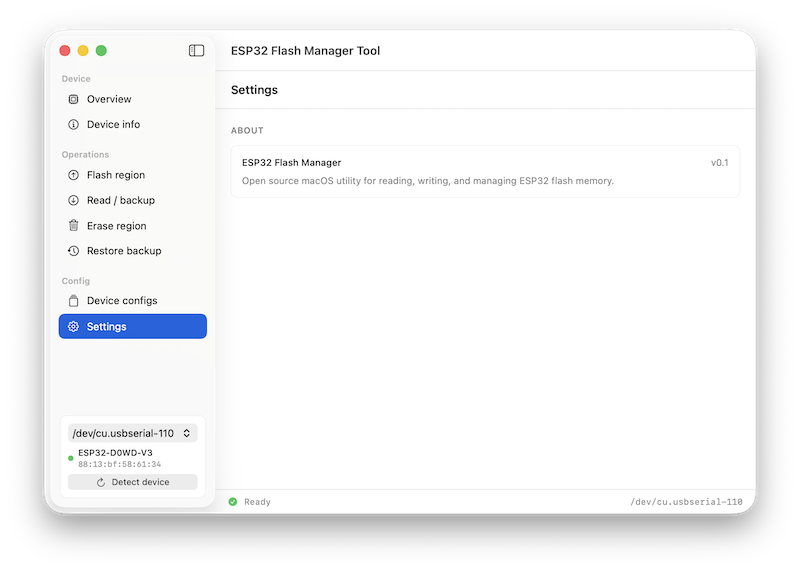
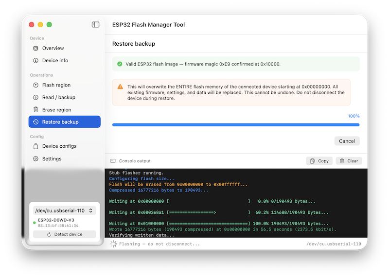

# ESP32 Flash Manager

A native macOS utility for reading, writing, erasing, and backing up flash memory regions on ESP32-based development boards.

Built with SwiftUI. Uses a bundled esptool binary for all device communication. No installation of Python or esptool required.



---

## Features

- **Auto-detects connected ESP32 devices** on launch — reads the partition table directly from the chip
- **Overview dashboard** — all flash regions displayed as cards with quick-action buttons
- **Flash a region** — write a .bin file to any flash address
- **Read / backup** — read any region to a timestamped .bin file
- **Erase a region** — fill any region with 0xFF bytes
- **Full board restore** — flash a complete merged image from address 0x00000000
- **JSON config system** — optional per-device config for custom region names, descriptions, and layouts
- **Live console output** — colour-coded esptool output streaming in real time
- **Copy to clipboard** — addresses, MAC, chip info, and full console log

---

## Screenshots

### Overview


> The app reads the partition table directly from the connected device. No config file needed.

---

### Device Info



---

### Flash a region



---

### Read / backup



---

### Erase a region



---

### Restore backup



---

### Device Configs: JSON config management



---

### Settings



---

### Console output



---

## Requirements

| Requirement | Detail |
|---|---|
| macOS | 14 Sonoma or later |
| Architecture | Apple Silicon (arm64) |
| Board | Any ESP32-based device |
| USB Driver | CP2104 — included with macOS or available from Silicon Labs |

---

## Tested Environment

This project has been developed and tested in the following environment. Behaviour on other configurations is unknown.

| Component | Detail |
|---|---|
| macOS | Tahoe 26.3 |
| Xcode | 26.3 (17C529) |
| Hardware | MacBook Pro 16" M3 Pro (Apple Silicon) |
| Arduino IDE | 2.3.8 |
| ESP32 Arduino Core | 3.3.8 (Espressif Systems) |
| Test board | SparkFun Thing Plus ESP32 WROOM (WRL-15663) |
| esptool | v5.2.0 (arm64) |

The minimum deployment target is **macOS 14 Sonoma**. The app has been tested on macOS Tahoe 26.3. It has not been tested on Sonoma or Sequoia. It may work on those versions but this is not guaranteed.

---

## Supported Hardware

Any ESP32-based device should work. Tested on:

- **SparkFun Thing Plus ESP32 WROOM (WRL-15663)** — ESP32-D0WD-V3 (revision 3.1), 16 MB flash, CP2104 USB bridge, GPIO 13 LED

---

## How It Works

On launch, the app scans for connected serial ports and runs esptool to identify the device. It then reads the partition table binary from flash address `0x8000` and parses it directly in Swift to build the region list. The Bootloader (`0x1000`) and Partition Table (`0x8000`) regions are added as fixed read-only entries since they are not listed in the partition table itself.

All flash operations are performed by launching the bundled `esptool` binary as a subprocess. Output is streamed line by line to the console panel in real time.

---

## JSON Device Config

The app works without any config file — the partition table is read directly from the device. A JSON config is optional. When loaded, it replaces the detected regions with a user-defined layout giving you full control over which regions are shown, their names, descriptions, and permitted operations.

To create a config for your device:

1. Go to **Device Configs → Export template…**
2. Edit the template with your device details
3. Import it via **Device Configs → Import config…**

See `config_template.json` in the repo for the full format with field descriptions. An example config for the SparkFun Thing Plus ESP32 WROOM is included in the project at `devices/sparkfun_thing_plus_esp32.json`.

---

## Project Structure

```
ESP32FlashManager/
├── ESP32FlashManagerApp.swift        — App entry point
├── ContentView.swift                 — All views and UI components
├── FlashViewModel.swift              — State management and flash operations
├── DeviceConfig.swift                — Data models (DeviceConfig, FlashRegion)
├── PartitionTableParser.swift        — Binary partition table parser
├── ESP32FlashManager.entitlements    — App entitlements
├── Assets.xcassets                   — App icons and assets
├── config_template.json              — JSON config template
├── esptool                           — Bundled esptool binary (unsigned — see below)
└── devices/
    └── sparkfun_thing_plus_esp32.json   — Example device config
```

---

## Building from Source

1. Clone the repo
2. Open `ESP32FlashManager.xcodeproj` in Xcode 14 or later
3. Select your development team under **Signing and Capabilities**
4. Ensure **App Sandbox** is disabled — required for subprocess execution
5. Sign the bundled esptool binary (see below)
6. Build and run with **Cmd+R**

---

## esptool Binary

The repository includes an unsigned esptool binary. Before building and running the app you will need to sign it with your own Apple Developer ID certificate:

```bash
codesign --force --sign "Developer ID Application: Your Name (TEAMID)" /path/to/esptool
```

Then strip the quarantine flag:

```bash
xattr -dr com.apple.quarantine /path/to/esptool
```

The binary is included in the xcode project and will be copied into the app bundle automatically at build time.

---

## Bundled esptool Details

| Property | Detail |
|---|---|
| Version | v5.2.0 |
| Architecture | arm64 (Apple Silicon) |
| Build tool | Nuitka (compiled from source) |
| Source | [https://github.com/espressif/esptool](https://github.com/espressif/esptool) |
| Licence | GPL v2 |

---

## Licence

### This Repository

This project is licensed under the **GNU General Public License v2 (GPL v2)**.

The bundled `esptool` binary is GPL v2 licensed by Espressif Systems.

What this means for you:

- You are free to use, copy, modify, and distribute this software
- Any distribution of this software or a modified version of it must also be released under GPL v2
- The source code must be made publicly available
- You cannot use this code as the basis for a closed-source or commercial product while the esptool dependency remains

The full GPL v2 licence text is included in the `LICENSE` file in this repository.

### esptool

esptool is copyright Espressif Systems and is licensed under GPL v2. Source: [https://github.com/espressif/esptool](https://github.com/espressif/esptool)

---

## Support, Contributions and Disclaimer

**This project is provided as-is.**

It is test software, shared publicly for reference. It is not actively maintained.

- **Issues and bug reports** will not be monitored or responded to
- **Pull requests and contributions** will not be accepted
- **Forks are welcome**

**Use entirely at your own risk.**

Flashing firmware to hardware carries an inherent risk of rendering a device inoperable if something goes wrong. The author accepts no responsibility for damage to hardware, data loss, voided warranties, or any other consequence arising from the use of this software, the source code, or the firmware files in this repository.

This software is provided without warranty of any kind, express or implied, including but not limited to warranties of merchantability, fitness for a particular purpose, or non-infringement.

**By using this software you accept these terms in full.**

---

## Acknowledgements

- [esptool](https://github.com/espressif/esptool) by Espressif Systems — used as a bundled subprocess for all device communication
- ESP32 partition table binary format — [Espressif documentation](https://docs.espressif.com/projects/esp-idf/en/latest/esp32/api-guides/partition-tables.html)
